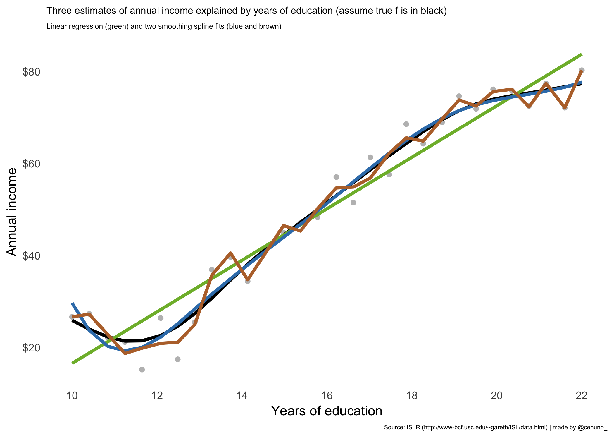

Statistical Learning
================
Cristian E. Nuno
February 09, 2019

-   [What is Statistical Learning?](#what-is-statistical-learning)
    -   [Why estimate f?](#why-estimate-f)
    -   [How Do We Estimate f?](#how-do-we-estimate-f)
    -   [The Trade-Off Between Prediction Accuracy and Model Interpretability](#the-trade-off-between-prediction-accuracy-and-model-interpretability)
    -   [Supervised Versus Unsupervised Learning](#supervised-versus-unsupervised-learning)
    -   [Regression Versus Classification Problems](#regression-versus-classification-problems)
-   [Assessing Model Accuracy](#assessing-model-accuracy)
    -   [Measuring the Quality of Fit](#measuring-the-quality-of-fit)
    -   [The Bias-Variance Trade-Off](#the-bias-variance-trade-off)
-   [Session Info](#session-info)

``` r
# load necessary packages -----
library(broom)
library(gridExtra)
library(here)
library(ISLR)
library(mgcv)
library(scales)
library(splines)
library(tidyverse)

# load necessary functions ----
source(here("00_functions", "01_build_single_models.R"))

# load necessary objects ----
my.theme <- 
  theme_minimal() + 
  theme(panel.grid = element_blank()
        , plot.caption = element_text(size = 5))

islr.text <-
  "Source: ISLR (http://www-bcf.usc.edu/~gareth/ISL/data.html) | made by @cenuno_"

wage.text <- "Source: Wage and other data for a group of 3000 male workers in the Mid-Atlantic region | made by @cenuno_"

chapter.text <-
  "Source: ISLR, Chapter 2 | made by @cenuno_"

# set dpi for all chunks ----
knitr::opts_chunk$set(dpi = 300)
```

What is Statistical Learning?
-----------------------------

Suppose that we are statistical consultants hired by a client to provide advice on how to improve sales of a particular product.

The [`Advertising`](https://github.com/cenuno/islr_notes/blob/master/00_raw_data/advertising.csv) data set consists of the `sales` of that product in 200 different markets, along with advertising budgets for the product in each of those markets for three different media: `TV`, `radio`, and `newspaper`.

While it isn't possible for the client to change the number of sales, they can control the advertising budget in each of the three media. Our goal is to adjust the advertising budget so that we may indirectly increase sales.

In this case, advertising budgets are the *input variables* - *X* - while `sales` is the *output variable* - *Y*.

*X* goes by many names: predictors, independent variables, features, or sometimes just variables. The same for *Y*: response or dependent variable.

The relationship between sales as a measured by each media type's advertising budget is shown belown.

``` r
# load necessary data ----
df <- 
  read_csv(here("00_raw_data", "advertising.csv")) %>%
  # drop row number column
  select(-X1)

# convert from wide to long ----
df.tidy <-
  df %>%
  gather(key = "type", value = "budget", -sales)

# visualize all three advertising types and their relationship to sales ----
df.tidy %>%
  ggplot(aes(x = budget, y = sales, color = type)) +
  geom_point(show.legend = FALSE) + 
  geom_smooth(se = FALSE
              , method = "lm"
              , color = "black") +
  scale_x_continuous(name = "Budget", labels = dollar) +
  scale_y_continuous(name = "Sales"
                     , labels = dollar
                     , limits = c(0, 30)) +
  facet_wrap(facets = vars(type)) +
  labs(title = "Increasing the radio advertisement budget\nincreases sales at a higher rate than both TV or newspapers"
       , caption = islr.text) +
  my.theme
```


Another example of visualizing the relationship between *X* and *Y* uses `income` and `years of education` from the [`Income1`](https://github.com/cenuno/islr_notes/blob/master/00_raw_data/income1.csv) data set.

``` r
# load necessary data ----
income1 <- 
  read_csv(here("00_raw_data", "income1.csv")) %>%
  select(-X1)

# scatter plot of income and education ----
base.plot <-
  income1 %>%
  ggplot(aes(x = Education, y = Income)) +
  geom_point(color = "orchid4") +
  scale_y_continuous(name = "Annual income"
                     , labels = function(i) paste0("$", i, "K")) +
  scale_x_continuous(name = "Years of education"
                     , breaks = pretty_breaks()) +
  my.theme +
  theme(plot.title = element_text(size = 8)
        , plot.subtitle = element_text(size = 6))

# add a loess line to the scatter plot ----
# note: also include residuals from loess line to actual points
loess.plot <-
  base.plot + 
  geom_smooth(se = FALSE
              , color = "#898b47"
              , method = "loess") +
  geom_segment(aes(xend = Education
                   , yend = loess(Income ~ Education, data = income1)$fitted)
               , color = "#47898b") +
  labs(title = "The error terms are between the points and the fitted line"
       , subtitle = "Some errors are positive (above the line)\nand others are negative (below the line)"
       , caption = islr.text)

# display both plots side by side ----
grid.arrange(base.plot + 
               labs(title = "More years of education are associated\nwith higher annual incomes")
             , loess.plot
             , nrow = 1
             , ncol = 2)
```


In the formula *Y* = *f*(*x*)+*ϵ*, *f* represents the *systematic* information that *X* provides about *Y*. *ϵ* is a random *error term* that is both independent from *X* and has a mean of zero.

**In essence, statistical learning refers to a set of approaches for estimating *f***. In this chapter we outline some of the key theoretical concepts that arise in estimating *f*, as well as tools for evaluating the estimates obtained.

### Why estimate f?

There are two main reasons that we may wish to estimate *f*: *prediction* and *inference*.

#### Prediction

In many situations, a set of inputs *X* are readily available, but the output *Y* cannot be easily obtained. Since the error term averages to zero, we can predict *Y* in this setting using the following formula:

$$\\hat{Y} = \\hat{f}(X)$$

where $\\hat{f}$ represents our estimate for *f*, and $\\hat{Y}$ represents the resulting prediction for *Y*. In this setting, $\\hat{f}$ is often treated as a black box, in the sense that one is not typically concerned with the exact form of *f*, provided that it yields accurate predictions for *Y*.

The accuracy of $\\hat{Y}$ as a prediction for *Y* depends on two quantitines: *reducible error* and *irreducible error*.

In general, $\\hat{f}$ will not be a perfect estimate for *f*, and this inaccuracy will introduce some error. This error is reducible because we can potentially improve the accuracy $\\hat{f}$ by using the most appropriate statistical learning technique to estimate *f*.

But perfection is not possible. This is because *Y* is also a function of *ϵ* - which by definition cannot be predicted using *X*. The quantity *ϵ* may contain both unmeasured variables and variation that are useful in predicting *Y*.

Since we don’t measure them, *f* cannot use them for its prediction.Therefore, variability associated with *ϵ* also affects the accuracy of our predictions.

This is known as the irreducible error, because no matter how well we estimate *f*, we cannot reduce the error introduced by *ϵ*.

**The focus of this book is on techniques for estimating *f* with the aim of minimizing the reducible error.**

It is important to keep in mind that the irreducible error will always provide an upper bound on the accuracy of our prediction for *Y*. *This bound is almost always unknown in practice.*

#### Inference

We are often interested in understanding the way that *Y* is affected as *X*1,...,*X*<sub>*p*</sub> change. In this situation we wish to estimate *f*, but our goal is not necessarily to make predictions for *Y*.

We instead want to understand the relationship between *X* and *Y*, or more specifically, to understand how *Y* changes as a function of *X*1,...,*X*<sub>*p*</sub>. Now $\\hat{f}$ cannot be treated as a black box, because we need to know its exact form.

The following questions now arise:

-   Which predictors are associated with the response?
    -   Identifying the few important predictors among a large set of possible variables can be extremely useful, depending on the application.
-   What is the relationship between the response and each predictor?

-   Can the relationship between *Y* and each predictor be adequately summarized using a linear equation, or is the relationship more complicated?

For instance, consider a company that is interested in conducting a direct-marketing campaign. The goal is to build a model that predicts how an individual will respond to the direct-marketing campaigin based on their demographics.

In this case, the demographic variables serve as predictors, and response to the marketing campaign (either positive or negative) serves as the outcome. The company is not interested in obtaining a deep understanding of the relationships between each individual predictor and the response; instead, the company simply wants an accurate model to predict the response using the predictors.

In contrast, consider the [`Advertising` data visualization](https://github.com/cenuno/islr_notes/blob/master/02_statistical_learning/README_files/figure-markdown_github/examine%20advertising-1.png) from earlier. One may be interested in answering questions such as:

-   Which media contribute to sales?

-   Which media generate the biggest boost in sales?

-   How much increase in sales is associated with a given increase in TV advertising?

This situation falls into the inference paradigm.

Another example involves modeling the brand of a product that a customer might purchase based on variables such as price, store location, discount levels, competition price, and so forth.

In this situation one might really be most interested in **how each of the individual variables affects** the probability of purchase. For instance, what effect will changing the price of a product have on sales? This is an example of modeling for inference.

Finally, some modeling could be conducted both for prediction and inference. For example, in a real estate setting, one may seek to relate values of homes to inputs such as crime rate, zoning, distance from a river, air quality, schools, income level of community, size of houses, and so forth.

In this case one might be interested in how the individual input variables affect the prices—that is, *how much extra will a house be worth if it has a view of the river*? This is an **inference** problem.

Alternatively, one may simply be interested in predicting the value of a home given its characteristics: *is this house under- or over-valued*? This is a **prediction** problem.

Depending on whether our ultimate goal is prediction, inference, or a combination of the two, different methods for estimating *f* may be appropriate.

For example, *linear models* allow for relatively simple and interpretable inference, but may not yield as accurate predictions as some other approaches.

In contrast, some of the highly non-linear approaches that we discuss in the later chapters of this book can potentially provide quite accurate predictions for *Y*, but this comes at the expense of a less interpretable model for which inference is more challenging.

### How Do We Estimate f?

Throughout this book, we explore many linear and non-linear approaches for estimating *f*. However, these methods generally share certain characteristics.

We will always assume that we have observed a set of *n* different data points. These observations are called the *training data* because we will use these observations to train, or teach, our method how to estimate *f*.

Let *x*<sub>*i**j*</sub> represent the value of the *j*<sup>*t**h*</sup> predictor, or input, for observation *i*, where *i* = 1,2,...,*n* and *j* = 1,2,...,*p*. Correspondingly, let *y*<sub>*i*</sub> represent the response variable for the *i*<sup>*t**h*</sup> observation. Then our training data consist of

{(*x*<sub>1</sub>,*y*<sub>1</sub>),(*x*<sub>2</sub>,*y*<sub>2</sub>),...,(*x*<sub>*n*</sub>,*y*<sub>*n*</sub>)} where *x*<sub>*i*</sub> ={(*x*<sub>*i*1</sub>,*x*<sub>*i*2</sub>,...,*x*<sub>*i**p*</sub>)}**<sup>*T*</sup>.

Our goal is to apply a statistical learning method to the training data in order to estimate the unknown function *f*. In other words, we want to find a function *f* such that *Y* ≈ *f*(*X*) for any observation (*X*, *Y*).

Broadly speaking, most statistical learning methods for this task can be characterized as either parametric or non-parametric.

#### Parametric Methods

Parametric methods involve a two-step model-based approach.

1.  Make an assumption about the functional form, or shape, of *f* (i.e. a linear model of *f*(*X*) = *β*<sub>0</sub> + *β*<sub>1</sub>*X*<sub>1</sub> + *β*<sub>2</sub>*X*<sub>2</sub> +... + *β*<sub>*p*</sub>*X*<sub>*p*</sub>).

2.  After a model has been selected, we need a procedure that uses the training data to *fit* or *train* the model. In the case of the linear model in step 1, we need to estimate the parameters *β*<sub>0</sub>,*β*<sub>1</sub>,...,*β*<sub>*p*</sub>. We want to find the values of these parameters such that *Y* ≈ *β*<sub>0</sub> + *β*<sub>1</sub>*X*<sub>1</sub> + *β*<sub>2</sub>*X*<sub>2</sub> +... + *β*<sub>*p*</sub>*X*<sub>*p*</sub>. A common approach for fitting linear models is the *ordinary least squares* approach.

The model-based approach just described is referred to as *parametric*; it reduces the problem of estimating *f* down to one of estimating a set of paramters.

Assuming a parametric form for *f* simplifies the problem of estimating *f* because it is generally much easier to estimate a set of parameters, such as *β*<sub>0</sub>,*β*<sub>1</sub>,...,*β*<sub>*p*</sub> in the linear model than it is to fit an entirely arbitrary function *f*.

The potential disadvantage of a parametric approach is that the model we choose will usually not match the true unknown form of *f*. If the chosen model is too far from the true *f*, then our estimate will be poor.

We can try to address this problem by choosing flexible models that can fit many different possible functional forms for *f*. But in general, fitting a more flexible model requires estimating a greater number of parameters.

These more complex models can lead to a phenomenon known as *overfitting* the data, which essentially means they follow the errors, or noise, too closely. Overfitting is an undesirable situation because the fit obtained will not yield accurate estimates of the response on new observations that were not part of the original training data set.

From the `Income` data set, a parametric approach to understanding `income` described by both `education` and `seniority` as a linear model would look like this:

*i**n**c**o**m**e* ≈ *β*<sub>0</sub> + *β*<sub>1</sub> \* *e**d**u**c**a**t**i**o**n* + *β*<sub>2</sub> \* *s**e**n**i**o**r**i**t**y*

Since we have assumed a linear relationship between the response and the two predictors, the entire fitting problem reduces to estimating *β*<sub>0</sub>,*β*<sub>1</sub>, and *β*<sub>2</sub>, which we do using least squares linear regression.

#### Non-parametric methods

Non-parametric methods do not make explicit assumptions about the functional form of *f*. Instead they seek an estimate of *f* that gets as close to the data points as possible without being too rough or wiggly.

Such approaches can have a major advantage over parametric approaches: by avoiding the assumption of a particular functional form for *f*, they have the potential to accurately fit a wider range of possible shapes for *f*.

Any parametric approach brings with it the possibility that the functional form used to estimate *f* is very different from the true *f*, in which case the resulting model will not fit the data well.

In contrast, non-parametric approaches completely avoid this danger, since essentially no assumption about the form of *f* is made. But non-parametric approaches do suffer from a major disadvantage: since they do not reduce the problem of estimating *f* to a small number of parameters, a very large number of observations (far more than is typically needed for a parametric approach) is required in order to obtain an accurate estimate for *f*.

### The Trade-Off Between Prediction Accuracy and Model Interpretability

Of the many methods that we examine in this book, some are less flexible, or more restrictive, in the sense that they can produce just a relatively small range of shapes to estimate *f*.

For example, linear regression is a relatively inflexible approach, because it can only generate linear functions. On the other hand, thin plate splines are considerably more flexible because they can generate a much wider range of possible shapes to estimate *f*.

``` r
# store statistical learning models ----
models <-
  tibble(method = c("Subset Selection"
                   , "Lasso"
                   , "Least Squares"
                   , "Generalized Additive Models"
                   , "Trees"
                   , "Bagging, Boosting"
                   , "Support Vector Machines")
         , flexibility = c(0.05
                           , 0.1
                           , 0.25
                           , 0.6
                           , 0.6
                           , 0.85
                           , 0.78)
         , interpretability = c(0.9
                                , 0.85
                                , 0.7
                                , 0.5
                                , 0.45
                                , 0.25
                                , 0.05))

# visualize each model's flexibility v. interpretability trade-off -----
models %>%
  ggplot(aes(x = flexibility, y = interpretability, label = method)) +
  geom_text(color = "tan4") +
  scale_x_continuous(name = "Flexibility"
                     , limits = c(0, 1)
                     , breaks = c(0, 1)
                     , labels = c("Low", "High")) +
  scale_y_continuous(name = "Interpretability"
                     , limits = c(0, 1)
                     , breaks = c(0, 1)
                     , labels = c("Low", "High")) +
  labs(title = "Trade-off between flexibility and interpretability amongst statistical learning methods"
       , subtitle = "In general, as the flexibility of a method increases, its interpretability decreases"
       , caption = chapter.text) +
  my.theme
```


The visual up above prokes a rational question: *why would we ever choose to use a more restrictive method instead of a very flexible approach?*

There are several reasons that we might prefer a more restrictive model. **If we are mainly interested in inference, then restrictive models are much more interpretable.**

For instance, when inference is the goal, the linear model may be a good choice since it will be quite easy to understand the relationship between *Y* and *X*<sub>1</sub>,*X*<sub>2</sub>,...,*X*<sub>*p*</sub>.

In contrast, very flexible approaches can lead to such complicated estimates of *f* that it is difficult to understand how any individual predictor is associated with the response.

-   Least squares linear regression: relatively inflexible but is quite interpretable.

-   Lasso: relies upon the linear model but uses an alternative fitting procedure for estimating the coefficients *β*<sub>0</sub>, *β*<sub>1</sub>, . . . , *β*<sub>*p*</sub>. The new procedure is more restrictive in estimating the coefficients, and sets a number of them to exactly zero. Hence in this sense the lasso is a less flexible approach than linear regression. It is also more interpretable than linear regression, because in the final model the response variable will only be related to a small subset of the predictors (namely those with nonzero coefficient estimates).

-   Generalized additive models (GAMs): extend the linear model to allow for certain non-linear relationships. Consequently, GAMs are more flexible than linear regression. They are also somewhat less interpretable than linear regression, because the relationship between each predictor and the response is now modeled using a curve.

-   Bagging, boosting, and support vector machines: fully non-linear methods with non-linear kernels are highly flexible approaches that are harder to interpret.

We have established that when **inference** is the goal, there are clear advantages to using simple and relatively inflexible statistical learning methods. We will often obtain more accurate predictions using a less flexible method. This phenomenon, which may seem counterintuitive at first glance, has to do with the potential for overfitting in highly flexible methods.

### Supervised Versus Unsupervised Learning

Most statistical learning problems fall into one of two categories: supervised or unsupervised.

The supervised learning domain requires that for each observation of the predictor measurement(s) *x*<sub>*i*</sub>, *i* = 1,...,*n* there is an associated response measurement *y*<sub>*i*</sub>. Here, the goal is to fit a model that relates the response to the predictors, with the aim of accurately predicting the response for future observations (**prediction**) or better understanding the relationship between the response and the predictors (**inference**). Many classical statistical learning methods such as linear regression and logistic regression, as well as more modern approaches such as GAM, boosting, and support vector machines, operate in the supervised learning domain.

Unsupervised learning requires that for every observation *i* = 1,...,*n*, we observe a vector of measurements *x*<sub>*i*</sub> but no associated response *y*<sub>*i*</sub>. It is not possible to fit a linear regression model, since there is no response variable to predict. In this setting, we are in some sense working blind; the situation is referred to as unsupervised because we lack a response variable that can supervise our analysis.

We can seek to understand the relationships between the variables or between the observations using unsupervised learning techniques.

One statistical learning tool that we may use in this setting is cluster analysis, or clustering. The goal of cluster analysis is to ascertain, on the basis of *x*<sub>1</sub>,...,*x*<sub>*n*</sub>, whether the observations fall into relatively distinct groups.

Many problems fall naturally into the supervised or unsupervised learning paradigms. However, sometimes the question of whether an analysis should be considered supervised or unsupervised is less clear-cut. For instance, suppose that we have a set of *n* observations. For *m* of the observations, where *m* &lt; *n*, we have both predictor measurements and a response measurement. For the remaining *n* − *m* observations, we have predictor measurements but no response measurement. Such a scenario can arise if the predictors can be measured relatively cheaply but the corresponding responses are much more expensive to collect. We refer to this setting as a *semi-supervised* learning problem. This topic is beyond the scope of this book.

### Regression Versus Classification Problems

Variables can be characterized as either *quantitative* or *qualitative* (also known as categorical). Quantitative variables take on numeric values, such as the number of shots made in an NBA game. Qualitative variables take on values in one of *K* different *classes* or categories, such as the name of the division that groups NBA teams by geography.

We tend to refer to problems with a quantitative response as *regression* problems, while those involving a qualitative response are often referred to as *classification problems*. However, the distinction is not always that crisp.

Least squares linear regression (Chapter 3) is used with a quantitative response, whereas logistic regression (Chapter 4) is typically used with a qualitative (two-class, or *binary*) response.

Yet because logistic regression estimates class probabilities, it can be viewed as both a regression and classification method. Some statistical methods, such as *K-nearest neighbors* (Chapters 2 and 4) and *boosting* (Chapter 8), can be used in the case of either quantitative or qualitative responses.

Most of the statistical learning methods discussed in this book can be applied regardless of the predictor variable type, provided that any qualitative predictors are *properly coded* before the analysis is performed.

Assessing Model Accuracy
------------------------

One of the key aims of this book is to introduce the reader to a wide range of statistical learning methods that extend far beyond the standard linear regression approach. *Why is it necessary to introduce so many different statistical learning approaches, rather than just a single best method?*

**There is no free lunch in statistics**: no one method dominates all others over all possible data sets. Selecting the best approach can be one of the most challenging parts of performing statistical learning in practice.

On a particular data set, one specific method may work best, but some other method may work better on a similar but different data set. Hence it is an important task to decide for any given set of data which method produces the best results.

### Measuring the Quality of Fit

In order to evaluate the performance of a statistical learning method on a given data set, we need some way to measure how well its predictions actually match the observed data.

That is, we need to quantify the extent to which the predicted response value for a given observation is close to the true response value for that observation.

In the regression setting, the most commonly-used measure is the **mean squared error (MSE)**, given by where *f*(*x*<sub>*i*</sub>) is the prediction that *f* gives for the *i*<sup>*t**h*</sup> observation. The MSE will be **small** if the predicted responses are very close to the true responses, and will be **large** if for some of the observations, the predicted and true responses differ substantially.

The MSE is computed using the training data that was used to fit the model, and so should more accurately be referred to as the *training MSE*. But in general, we do not really care how well the method works on the training data.

Instead, **we are interested in the accuracy of the predictions that we obtain when we apply our method to previously unseen test data**. We want to choose the method that gives the lowest test MSE, as opposed to the lowest training MSE.

In other words, if we had a large number of test observations, we could compute the average squared prediction error for these test observations (*x*<sub>0</sub>, *y*<sub>0</sub>) as $Ave(y\_0) - \\hat{f}(x\_0))^2$. We’d like to select the model for which the average of this quantity—the test MSE—is as small as possible.

How can we go about trying to select a method that minimizes the test MSE? In some settings, we may have a test data set available—that is, we may have access to a set of observations that were not used to train the statistical learning method.

In that case, we evaluate the average squared prediction error for the test observations and select the learning method for which the test MSE is smallest.

But what if no test observations are available? In that case, **do not** simply selecting a statistical learning method that minimizes the training MSE.

There is no guarantee that the method with the lowest training MSE will also have the lowest test MSE. Roughly speaking, the problem is that many statistical methods specifically estimate coefficients so as to minimize the training set MSE. For these methods, the training set MSE can be quite small, but the test MSE is often much larger.

``` r
# using the income1 dataset, visualize 3 estimates of f ----
# note: in this case, assume true f is a generalized additive model
f.estimates <- build_single_models(x = "Education", y = "Income", df = income1)
  
f.estimates.plot <-
  income1 %>%
  ggplot(aes(x = Education, y = Income)) +
  geom_point(color = "gray") +
  geom_line(data = f.estimates$gam
            , aes(x = Education, y = .fitted)
            , color = "black"
            , size = 1.25) +
  geom_line(data = f.estimates$linear
            , aes(x = Education, y = .fitted)
            , color = "#7eb837"
            , size = 1.25) +
  geom_line(data = f.estimates$ss_df6
            , aes(x = Education, y = .fitted)
            , color = "#377eb8"
            , size = 1.25) +
  geom_line(data = f.estimates$ss_df22
            , aes(x = Education, y = .fitted)
            , color = "#b87137"
            , size = 1.25) +
  scale_x_continuous("Years of education"
                     , breaks = pretty_breaks()) +
  scale_y_continuous(name = "Annual income", labels = dollar) +
  labs(title = "Three estimates of annual income explained by years of education (assume true f is in black)"
       , subtitle = "Linear regression (green) and two smoothing spline fits (blue and brown)"
       , caption = islr.text) +
  my.theme +
  theme(plot.title = element_text(size = 8)
        , plot.subtitle = element_text(size = 6))
  
# display plot
f.estimates.plot
```



This relationship between the test and training MSE is shown in the figures up above. The plot on the left-hand side illustrates three possible estimates for *f* obtained using methods with increasing levels of flexibility.

The green line is the linear regression fit, which is relatively inflexible. The blue and brown curves were produced using smoothing splines, discussed in Chapter 7, with different levels of smoothness.

**It is clear that as the level of flexibility increases, the curves fit the observed data more closely**. The brown curve is the most flexible and matches the data very well; however, we observe that it fits the true *f* (shown in black) poorly because it is too wiggly.

The degrees of freedom is a quantity that summarizes the flexibility of a curve; it is discussed more fully in Chapter 7.

When a given method yields a small training MSE but a large test MSE, we are said to be *overfitting* the data. Overfitting refers specifically to the case in which a less flexible model would have yielded a smaller test MSE.

Notice the *U-shape* in the test MSE. This is a fundamental property of statistical learning that holds regardless of the particular data set at hand and regardless of the statistical method being used: **as model flexibility increases, training MSE will decrease, but the test MSE may not**.

This happens because our statistical learning procedure is working too hard to find patterns in the training data, and may be picking up some patterns that are just caused by random chance rather than by true properties of the unknown function *f*.

When we overfit the training data, the test MSE will be very large because the supposed patterns that the method found in the training data simply don’t exist in the test data. Note that regardless of whether or not overfitting has occurred, **we almost always expect the training MSE to be smaller than the test MSE because most statistical learning methods either directly or indirectly seek to minimize the training MSE**.

### The Bias-Variance Trade-Off

The U-shape observed in the test MSE curves turns out to be the result of two competing properties of statistical learning methods.

Though the mathematical proof is beyond the scope of this book, it is possible to show that the expected test MSE, for a given value *x*<sub>0</sub>, can always be decomposed into the sum of three fundamental quantities: the *variance* of $\\hat{f}(x\_0)$, the squared *bias* of *f*(*x*<sub>0</sub>) and the variance of the error terms ε.

$E(y\_0 - \\hat{f}(x\_0)) = Var(\\hat{f}(x\_0)) + \[Bias(\\hat{f}(x\_0))^2\] + Var(\\epsilon)$

The equation tells us that **in order to minimize the expected test error, we need to select a statistical learning method that simultaneously achieves low variance and low bias**.

Note that variance is inherently a nonnegative quantity, and squared bias is also nonnegative. Hence, we see that the expected test MSE can never lie below Var(ε), the irreducible error.

What do we mean by the **variance** and **bias** of a statistical learning method?

Variance refers to the amount by which $\\hat{f}$ would change if we estimated it using a different training data set. In general, more flexible statistical methods have higher variance.

Since the training data are used to fit the statistical learning method, different training data sets will result in a different $\\hat{f}$.

But ideally the estimate for *f* should not vary too much between training sets. However, if a method has high variance then small changes in the training data can result in large changes in $\\hat{f}$.

On the other hand, bias refers to the error that is introduced by approximating a real-life problem, which may be extremely complicated, by a much simpler model.

Session Info
------------

``` r
sessioninfo::session_info()
```

    ## ─ Session info ──────────────────────────────────────────────────────────
    ##  setting  value                       
    ##  version  R version 3.5.2 (2018-12-20)
    ##  os       macOS High Sierra 10.13.6   
    ##  system   x86_64, darwin15.6.0        
    ##  ui       X11                         
    ##  language (EN)                        
    ##  collate  en_US.UTF-8                 
    ##  ctype    en_US.UTF-8                 
    ##  tz       America/Chicago             
    ##  date     2019-02-09                  
    ## 
    ## ─ Packages ──────────────────────────────────────────────────────────────
    ##  package     * version date       lib source        
    ##  assertthat    0.2.0   2017-04-11 [1] CRAN (R 3.5.0)
    ##  backports     1.1.3   2018-12-14 [1] CRAN (R 3.5.0)
    ##  bindr         0.1.1   2018-03-13 [1] CRAN (R 3.5.0)
    ##  bindrcpp      0.2.2   2018-03-29 [1] CRAN (R 3.5.0)
    ##  broom       * 0.5.1   2018-12-05 [1] CRAN (R 3.5.0)
    ##  cellranger    1.1.0   2016-07-27 [1] CRAN (R 3.5.0)
    ##  cli           1.0.1   2018-09-25 [1] CRAN (R 3.5.0)
    ##  colorspace    1.3-2   2016-12-14 [1] CRAN (R 3.5.0)
    ##  crayon        1.3.4   2017-09-16 [1] CRAN (R 3.5.1)
    ##  digest        0.6.18  2018-10-10 [1] CRAN (R 3.5.0)
    ##  dplyr       * 0.7.8   2018-11-10 [1] CRAN (R 3.5.0)
    ##  evaluate      0.12    2018-10-09 [1] CRAN (R 3.5.0)
    ##  forcats     * 0.3.0   2018-02-19 [1] CRAN (R 3.5.0)
    ##  generics      0.0.2   2018-11-29 [1] CRAN (R 3.5.0)
    ##  ggplot2     * 3.1.0   2018-10-25 [1] CRAN (R 3.5.0)
    ##  glue          1.3.0   2018-07-17 [1] CRAN (R 3.5.0)
    ##  gridExtra   * 2.3     2017-09-09 [1] CRAN (R 3.5.0)
    ##  gtable        0.2.0   2016-02-26 [1] CRAN (R 3.5.0)
    ##  haven         2.0.0   2018-11-22 [1] CRAN (R 3.5.0)
    ##  here        * 0.1     2017-05-28 [1] CRAN (R 3.5.0)
    ##  hms           0.4.2   2018-03-10 [1] CRAN (R 3.5.0)
    ##  htmltools     0.3.6   2017-04-28 [1] CRAN (R 3.5.0)
    ##  httr          1.4.0   2018-12-11 [1] CRAN (R 3.5.0)
    ##  ISLR        * 1.2     2017-10-20 [1] CRAN (R 3.5.0)
    ##  jsonlite      1.6     2018-12-07 [1] CRAN (R 3.5.0)
    ##  knitr         1.21    2018-12-10 [1] CRAN (R 3.5.2)
    ##  labeling      0.3     2014-08-23 [1] CRAN (R 3.5.0)
    ##  lattice       0.20-38 2018-11-04 [1] CRAN (R 3.5.2)
    ##  lazyeval      0.2.1   2017-10-29 [1] CRAN (R 3.5.0)
    ##  lubridate     1.7.4   2018-04-11 [1] CRAN (R 3.5.0)
    ##  magrittr      1.5     2014-11-22 [1] CRAN (R 3.5.0)
    ##  Matrix        1.2-15  2018-11-01 [1] CRAN (R 3.5.2)
    ##  mgcv        * 1.8-26  2018-11-21 [1] CRAN (R 3.5.2)
    ##  modelr        0.1.2   2018-05-11 [1] CRAN (R 3.5.0)
    ##  munsell       0.5.0   2018-06-12 [1] CRAN (R 3.5.0)
    ##  nlme        * 3.1-137 2018-04-07 [1] CRAN (R 3.5.2)
    ##  pillar        1.3.1   2018-12-15 [1] CRAN (R 3.5.0)
    ##  pkgconfig     2.0.2   2018-08-16 [1] CRAN (R 3.5.0)
    ##  plyr          1.8.4   2016-06-08 [1] CRAN (R 3.5.0)
    ##  purrr       * 0.2.5   2018-05-29 [1] CRAN (R 3.5.0)
    ##  R6            2.3.0   2018-10-04 [1] CRAN (R 3.5.0)
    ##  Rcpp          1.0.0   2018-11-07 [1] CRAN (R 3.5.0)
    ##  readr       * 1.3.1   2018-12-21 [1] CRAN (R 3.5.0)
    ##  readxl        1.2.0   2018-12-19 [1] CRAN (R 3.5.0)
    ##  rlang         0.3.1   2019-01-08 [1] CRAN (R 3.5.2)
    ##  rmarkdown     1.11    2018-12-08 [1] CRAN (R 3.5.0)
    ##  rprojroot     1.3-2   2018-01-03 [1] CRAN (R 3.5.0)
    ##  rstudioapi    0.9.0   2019-01-09 [1] CRAN (R 3.5.2)
    ##  rvest         0.3.2   2016-06-17 [1] CRAN (R 3.5.0)
    ##  scales      * 1.0.0   2018-08-09 [1] CRAN (R 3.5.0)
    ##  sessioninfo   1.1.1   2018-11-05 [1] CRAN (R 3.5.0)
    ##  stringi       1.2.4   2018-07-20 [1] CRAN (R 3.5.0)
    ##  stringr     * 1.3.1   2018-05-10 [1] CRAN (R 3.5.0)
    ##  tibble      * 2.0.1   2019-01-12 [1] CRAN (R 3.5.2)
    ##  tidyr       * 0.8.2   2018-10-28 [1] CRAN (R 3.5.0)
    ##  tidyselect    0.2.5   2018-10-11 [1] CRAN (R 3.5.0)
    ##  tidyverse   * 1.2.1   2017-11-14 [1] CRAN (R 3.5.0)
    ##  withr         2.1.2   2018-03-15 [1] CRAN (R 3.5.0)
    ##  xfun          0.4     2018-10-23 [1] CRAN (R 3.5.0)
    ##  xml2          1.2.0   2018-01-24 [1] CRAN (R 3.5.0)
    ##  yaml          2.2.0   2018-07-25 [1] CRAN (R 3.5.0)
    ## 
    ## [1] /Library/Frameworks/R.framework/Versions/3.5/Resources/library
